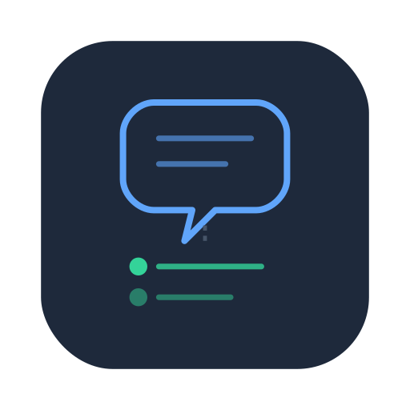

  

# AIChatLog (Archived)

> This monorepo has been split into individual repositories. Please visit the new repos below.

| Repository | Description |
|---|---|
| [aichatlog-server](https://github.com/aichatlog/aichatlog-server) | Go REST API + MCP server |
| [aichatlog-plugin-cc](https://github.com/aichatlog/aichatlog-plugin-cc) | Claude Code capture plugin |
| [aichatlog-protocol](https://github.com/aichatlog/aichatlog-protocol) | ConversationObject protocol spec |
| [aichatlog-docs](https://github.com/aichatlog/aichatlog-docs) | Product design documents |
| [awesome-aichatlog](https://github.com/aichatlog/awesome-aichatlog) | Curated resource list |

## What is AIChatLog?

An open-source platform that captures AI conversations from any source and syncs them to your knowledge base. See the individual repos for documentation and usage.

## License

[AGPL-3.0](LICENSE)
